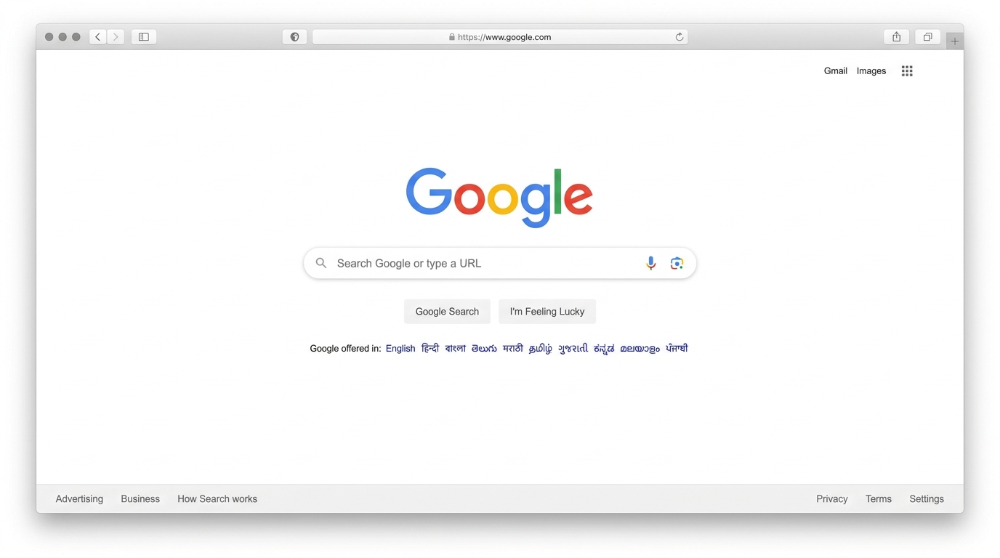
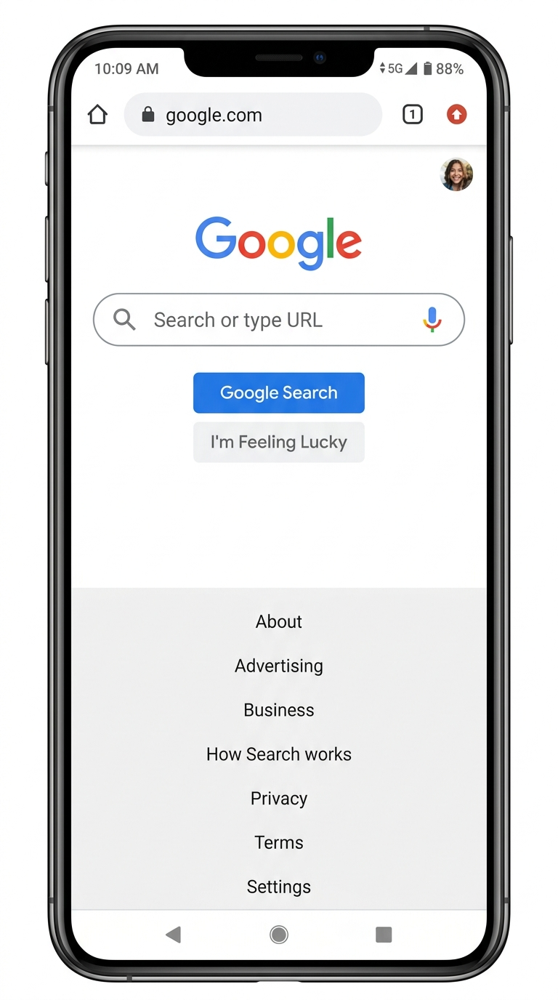

# Google Homepage Clone

A pixel-perfect, clean, and fully responsive clone of the modern Google Homepage built exclusively with **HTML5 and CSS3**.

This project demonstrates clean coding practices, semantic HTML5 structure, modern CSS flexbox layouts, hover effects, CSS custom properties, and media query responsiveness without using any JavaScript or third-party CSS frameworks.

---

## Features

* **Semantic HTML5 Structure**: Uses `<header>`, `<main>`, `<nav>`, and `<footer>` elements for proper accessibility and SEO.
* **Pure CSS3**: Built with modern CSS custom properties (variables), Flexbox layout, and CSS Grid principles.
* **Pixel-Perfect Google Aesthetics**: Recreates the search bar shadow elevation, Google logo scaling, grey action buttons, blue language links, and footer layout.
* **Fully Responsive**: Adapts seamlessly to Desktop, Laptop, Tablet, and Mobile viewports using responsive media queries.
* **Smooth Hover Effects**: Interactive feedback on buttons, search box elevation on focus/hover, header links, and footer options.
* **Zero Dependencies**: 0% JavaScript, 0% Bootstrap/Tailwind. Lightweight and fast loading.

---

## Technologies Used

* **HTML5** (Markup and Semantics)
* **CSS3** (Variables, Flexbox, Transitions, Media Queries)
* **Google Fonts** (Roboto)
* **SVG Icons** (Google Logo, Search, Voice Search, Google Lens, Apps Grid)

---

## Folder Structure

```
google-homepage-clone/

│── index.html
│── style.css
│── README.md
│── assets/
│     ├── google-logo.svg
│     ├── avatar.png
│     ├── favicon.png
│     ├── search.svg
│     ├── mic.svg
│     ├── lens.svg
│     └── apps.svg
│
└── screenshots/
      ├── desktop.png
      └── mobile.png
```

---

## Screenshots

| Desktop View | Mobile View |
| :---: | :---: |
|  |  |

---

## Future Improvements

* Add a CSS-only dark theme toggle option using `:checked` state on a hidden checkbox.
* Include CSS-only popup modal simulation for the 9-dots Google Apps drawer.
* Add keyframe micro-animations for voice search microphone listening state.

---

## Author

* **Saumy Mishra** (KodBud Frontend Engineering Intern)
